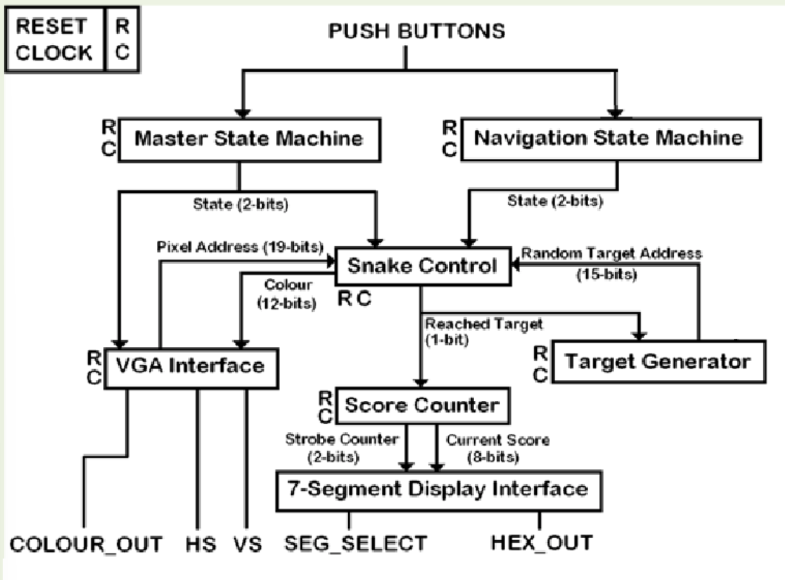

# Verilog Snake Game on VGA Display

Classic **Snake**, recreated entirely in synthesizable Verilog and shown on a 640 × 480 @ 60 Hz VGA monitor.  
The design targets the Digilent **Basys 3** board (Artix-7 XC7A35T-1CPG236C) but can be ported to any FPGA with a spare RGB-video connector.

---

## Table of Contents


---

## Features
* **True 60 Hz VGA timing** (pixel-perfect 640 × 480).
* **Modular RTL** – each logical block lives in its own file.
* **LFSR-based food generator** → pseudo-random & in-bounds.
* **Two-digit score** on the on-board 7-segment display.
* **Idle / Play / Win / Fail** finite-state machine with timeout.
* **Colour-cycling border** for a retro arcade vibe.

---

## Design Overview



### `Wrapper.v`
Wires up all sub-modules and connects to Basys 3 I/O.

### `VGA_Interface.v`
Generates sync pulses and (X,Y) pixel positions.

### `SnakeControl.v`
Tracks the body, detects collisions, and handles drawing.

### `Navigation_SM.v`
Simple FSM that responds to directional inputs.

### `Master_SM.v`
Top-level game state manager (Idle, Play, Win, Fail).

### `TargetGenerator.v`
10-bit LFSR gives random food coordinates.

### `ScoreCounter.v`
Two-digit BCD score counter and 7-segment driver.


## Repository Layout

```text
Verilog_snake_game_on_VGA_display/
├── Snake_Game.srcs/
│   ├── sources_1/new/        # All synthesizable RTL
│   │   ├── Wrapper.v         # <- top-level entity
│   │   ├── VGA_Interface.v   # VGA timing generator
│   │   ├── SnakeControl.v    # Body, collisions & rendering
│   │   ├── Navigation_SM.v   # Direction state-machine
│   │   ├── Master_SM.v       # Idle/Play/Win/Fail FSM
│   │   ├── TargetGenerator.v # Pseudo-random food
│   │   ├── ScoreCounter.v    # 2-digit BCD / 7-seg driver
│   │   ├── GenericCounter.v  # Parameterised counters
│   │   └── InvertCorners.v   # Border colour-cycler
│   └── constrs_1/new/
│       └── Snake_Constraints.xdc   # Basys 3 pin-out
├── Snake_System_Architecture.png   # Block diagram
└── README.md                       # You are here
```

## Quick-Start (Vivado)

### Create a New Project

- Board → **Digilent Basys 3**
- Add every file in `Snake_Game.srcs/sources_1/new/`
- Set `Wrapper.v` as the **Top Module**
- Add `Snake_Constraints.xdc`

### Synthesis & Implementation

Click **Generate Bitstream** or run batch mode:

Open Hardware Manager → Program Device — connect your board and enjoy!

## Gameplay and Controls

## Gameplay & Controls

| Button   | Action                         |
|----------|--------------------------------|
| `BTNU`   | Move Up                        |
| `BTND`   | Move Down                      |
| `BTNL`   | Move Left                      |
| `BTNR`   | Move Right                     |
| `BTNC`   | Reset / Start (Idle/Win/Fail)  |

Each time the snake’s head hits the flashing target, it grows by one square and the score advances (00–99).  
Self-collision or wall-collision triggers **FAIL**; reaching the preset score limit triggers **WIN**.


